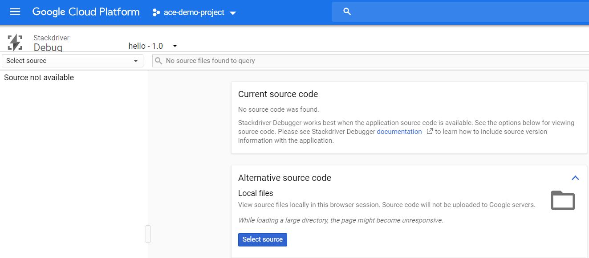
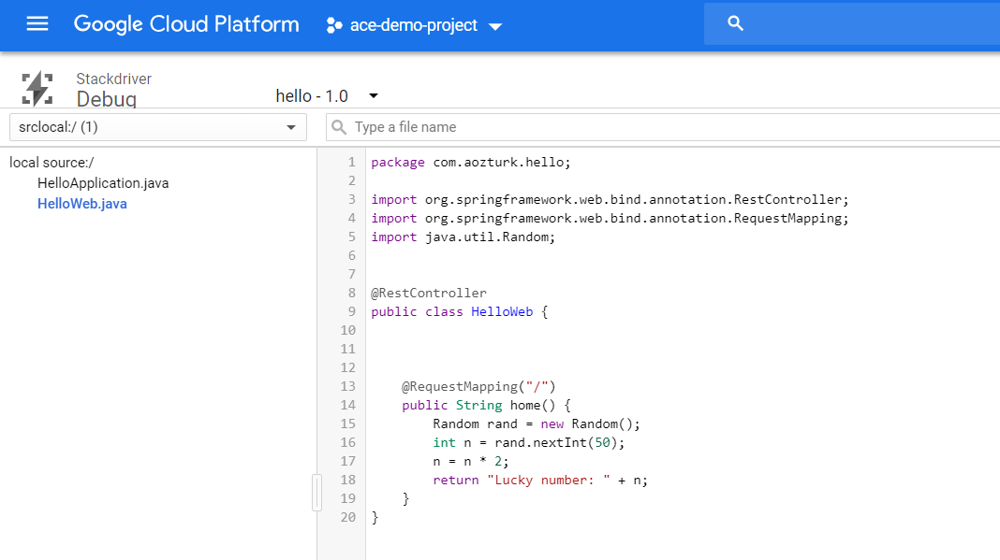
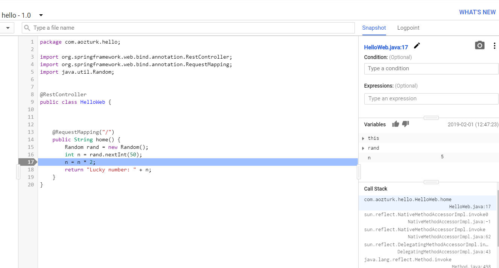

# Setting Up Stackdriver Debugger for Java in GKE 

This is a step by step guide about how to set up Stackdriver debugging and using snapshots (breakpoints). A sample Java application running on Tomcat is used.


### Prerequisities

Make sure your Kubernetes cluster is created with one of the following access scopes:

- https://www.googleapis.com/auth/cloud-platform
- https://www.googleapis.com/auth/cloud_debugger


### Building Docker Image

Java source code is in the source folder. This is a basic Spring Boot web application. When it is built, a jar file is being created.

To build a Docker image, make a directory and move the Dockerfile and jar file into it. Then run these commands within the directory:

```
docker build -t aozturk12/hello:1.0 .
docker push aozturk12/hello:1.0
```

aozturk12 is an account in Docker Hub. Later we will use this image in Kubernetes. 

There are two points to notice in Dockerfile. First, we intentionally use google-appengine openjdk, because it has java debugger agent pre-installed.
Second, JAVA_OPTS environment variable is set for Tomcat.

### Deploying app to GKE

```
kubectl create ns web
kubectl apply -f app-deployment.yml
kubectl apply -f app-service.yml
kubectl get svc -n web
```

Please note the external IP of the service.

### Stackdriver Debugging

Open a browser, hit the Load Balancer IP and see it works. The returning text should be like: "Lucky number: 58"

Now it is time to move to Stackdriver Debug page from the console.




As you can see source code is not available. We can upload it by using "Alternative source code - Local files" section.




Now the source code is in Debug page.

We can take a snapshot by clicking a line number. A snapshot is a breakpoint but it does not stop application from running. Remember to access the application from browser one more time.




Now, we can take a look at the variables, call stack etc.

Because we have a breakpoint in the line "n=n*2", variable n in the Stackdriver Debug page is half of the number we see in the browser page as expected.

### References

https://cloud.google.com/debugger/docs/setup/java


