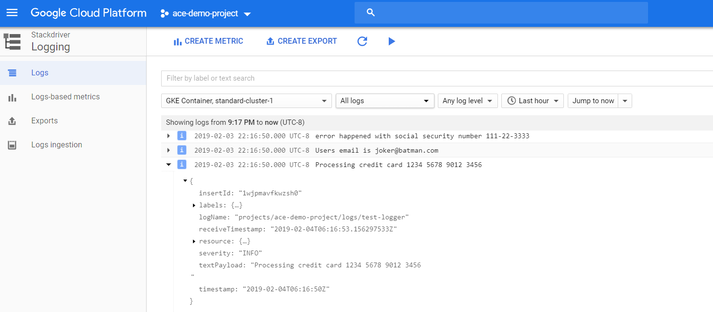
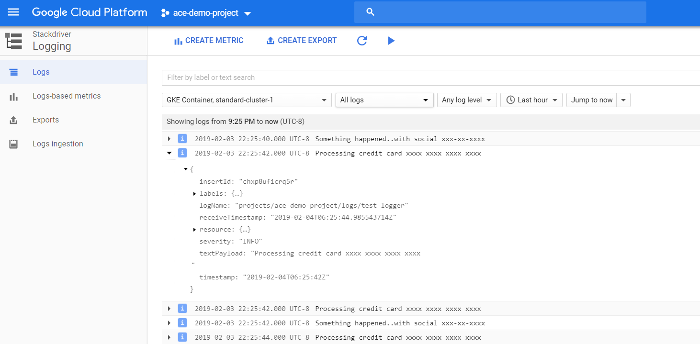

# Customizing Stackdriver Logs for GKE

This is a step by step guide about how to customize Stackdriver logs by using different Fluentd configmap. Fluentd is the log collector and deployed as a daemonset to Kubernetes.

### Prerequisities

Make sure your Kubernetes cluster is created with Stackdriver logging service disabled. If you are creating cluster with gcloud command, please use the parameter "--no-enable-cloud-logging".

### Deploying Sample Application

```
kubectl apply -f test-logger.yaml
```

This is an application that emits random logging statements.

### Deploying Fluentd

```
kubectl apply -f fluentd-configmap.yaml
kubectl apply -f fluentd-daemonset.yaml
kubectl get pods -n kube-system
```

Wait till fluentd pods are running and then visit Stackdriver logging page in the console.



Some sensitive data like Social Security numbers, credit card numbers and email addresses can be seen in the logs. These data should be filtered out.

### Filtering Logs

```
kubectl apply -f fluentd-configmap-filtered.yaml
kubectl apply -f fluentd-daemonset-filtered.yaml
kubectl get pods -n kube-system
```

Applying new daemonset manifest will rollout the fluentd deployment. Wait for a few seconds and see all 3 pods are replaced. After that, revisit Stackdriver logging page.



Now, there is no sensitive data in the logs. Please take a look at the two configmap yaml files and see the difference.

### References

https://cloud.google.com/solutions/customizing-stackdriver-logs-fluentd

