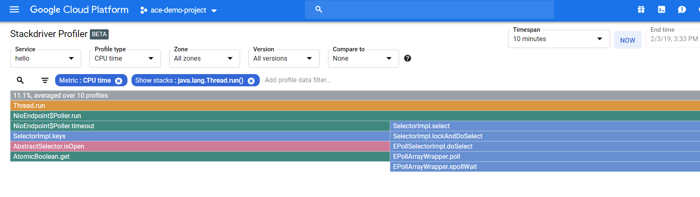

# Setting Up Stackdriver Profiler for Java in GKE 

This is a step by step guide about how to set up Stackdriver profiling. A sample Java application running on Tomcat is used.

### Prerequisities

Make sure the Profiler API is enabled:

```
gcloud services enable cloudprofiler.googleapis.com
```

### Building Docker Image

Java source code is in the source folder. This is a basic Spring Boot web application. When it is built, a jar file is being created.

To build a Docker image, make a directory and move the Dockerfile and jar file into it. Then run these commands within the directory:

```
docker build -t aozturk12/profile:1.0 .
docker push aozturk12/profile:1.0
```

aozturk12 is an account in Docker Hub. Later we will use this image in Kubernetes. 

There are two points to notice in Dockerfile. First, we intentionally use google-appengine openjdk, because it has java profiler agent pre-installed.
Second, java agent configuration options are specified.

### Deploying app to GKE

```
kubectl create ns web
kubectl apply -f app-deployment.yml
kubectl apply -f app-service.yml
kubectl get svc -n web
```

Please note the external IP of the service.

### Stackdriver Profiling

Open a browser, hit the Load Balancer IP and see it works. The returning text should be like: "Lucky number: 28"

Now it is time to move to Stackdriver Profiler page from the console.



You can see the CPU time metric for functions. CPU time is the time the CPU spends executing a block of code. You can hover over the functions to see the details.


### References

https://cloud.google.com/profiler/docs/profiling-java


