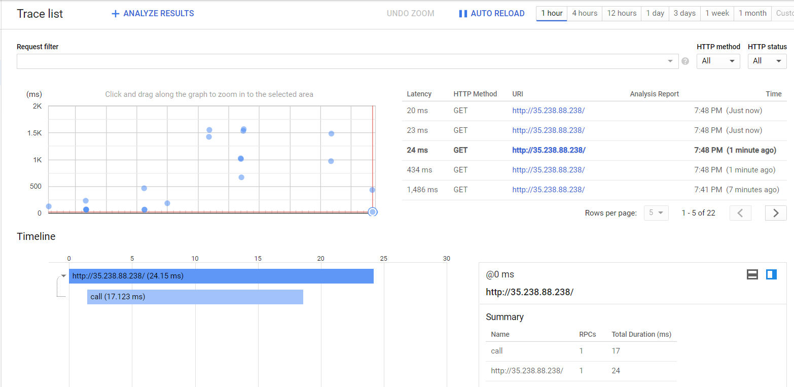

# Setting Up Stackdriver Trace for Java in GKE 

This is a step by step guide about how to set up Stackdriver tracing. A sample Java application running on Tomcat is used.


### Prerequisities

Make sure your GKE cluster is created with following access scope:

https://www.googleapis.com/auth/trace.append


### Building Docker Image

Java source code is in the source folder. This is a basic Spring Boot web application. When it is built, a jar file is being created.

To build a Docker image, make a directory and move the Dockerfile and jar file into it. Then the command is:

```
docker build -t aozturk12/trace:2.1 .
docker push aozturk12/trace:2.1
```

aozturk12 is an account in Docker Hub. Later we will use this image in Kubernetes. 

### Deploying app to GKE

```
kubectl create ns web
kubectl apply -f app-deployment.yml
kubectl apply -f app-service.yml
kubectl get svc -n web
```

Please note the external IP of the service.

### Stackdriver Tracing

Open a browser, hit the IP and see it works. The returning text should be: "Hello, Guest!"

Now it is time to move to Stackdriver Trace page from the console. 



After hitting the IP a few times you should see the points in the graph. By selecting a point, you can see the details of the calls. This is really useful for latency analysis.

### References

https://cloud.google.com/trace/docs/setup/java


